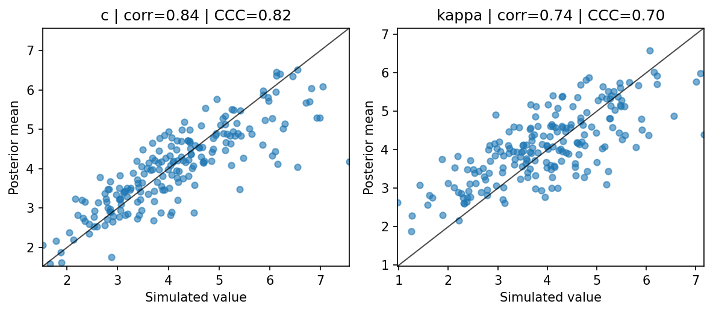

# Build and check a simple SDM workflow

This article walks through a complete fixed-trial simple workflow for the
standard diffusion model (SDM). It uses the same model-specific prior style as
the 2026 BayesFlow-Ind SDM analysis, with settings aligned to the local
fixed-simple SDM run that produced the recovery plot below.

The workflow estimates two SDM parameters from trial-level signed circular
errors:

- `c`: memory precision or signal strength parameter
- `kappa`: circular error concentration parameter

The built-in SDM simulator returns one signed error in radians per trial.

## Define model settings

Keep the model-specific settings near the top of the script. This makes it easy
to see which choices define the scientific model and which choices only control
training.

```python
import numpy as np

from bami.simulators import simulate_sdm_simple
from bami.workflows import SimpleWorkflow


PRIORS = {
    "c": {"mean": "normal(4, 1.2)", "sd": 0.5, "link": "softplus"},
    "kappa": {"mean": "normal(4, 1.2)", "sd": 0.5, "link": "softplus"},
}
```

`mean` and `sd` are defined on the raw parameter scale. The `softplus` link
then converts raw draws to positive public values before the simulator sees
them. This is useful for SDM parameters because `c` and `kappa` must be
positive, but a hard lower boundary can make training less stable.

## Build the workflow

```python
np.random.seed(2026)

model = SimpleWorkflow(
    name="SDM",
    param_names=["c", "kappa"],
    priors=PRIORS,
    simulator=simulate_sdm_simple,
    observation="trial",
    obs_names=["error"],
    n_trials=100,
)
```

The workflow now knows the full simulation contract:

- draw `c` and `kappa` from the prior dictionary
- pass public-scale values to `simulate_sdm_simple(...)`
- request 100 trial rows
- treat each row as one trial-level feature named `error`

## Simulate validation data

```python
validation_data = model.simulate(200)
print(validation_data["data"].shape)
```

Expected shape:

```text
(200, 100, 1)
```

The dimensions mean:

- `200` simulated datasets
- `100` trial rows per dataset
- `1` feature per trial: signed circular error in radians

Observed SDM data should use the same convention before being passed to a
workflow: one row per trial, with errors in radians in the interval `[-pi, pi]`.

## Train or load the workflow

`train_workflow()` loads the saved workflow when the file already exists. Use
`overwrite=True` only when you intentionally want to retrain.

```python
history = model.train_workflow(
    max_epochs=50,
    initial_epochs=5,
    n_batch=100,
    batch_size=256,
    validation_data=validation_data,
    patience=5,
    min_delta=0.01,
    workers=6,
    max_queue_size=8,
    file="results/13_SDM/models/13_SDM_fixed_simple_continuous_workflow.keras",
)
```

These settings match the local fixed-simple SDM workflow. For a quick smoke
test on a laptop, reduce `max_epochs`, `n_batch`, `batch_size`, or the number
of validation datasets first, then return to the full settings for the final
recovery run.

## Sample posterior parameters

Simulate a small recovery set and sample from the posterior.

```python
test_data = model.simulate(20)
samples = model.sample_posterior(
    test_data=test_data,
    num_samples=200,
)

print(samples["c"].shape)
```

Typical shape:

```text
(20, 200)
```

The first dimension indexes simulated datasets. The second dimension indexes
posterior samples.

## Run a recovery diagnostic

Use the built-in diagnostic when you want to check one fitted simple workflow.

```python
fig = model.plot_parameter_recovery(
    n_datasets=200,
    num_samples=500,
    metrics=["corr", "ccc"],
)
```

Example output from a local SDM fixed-simple run:



These recovery settings match the local plot. More recovery datasets give a
more stable diagnostic; more posterior samples give a more stable posterior
mean for each dataset.
